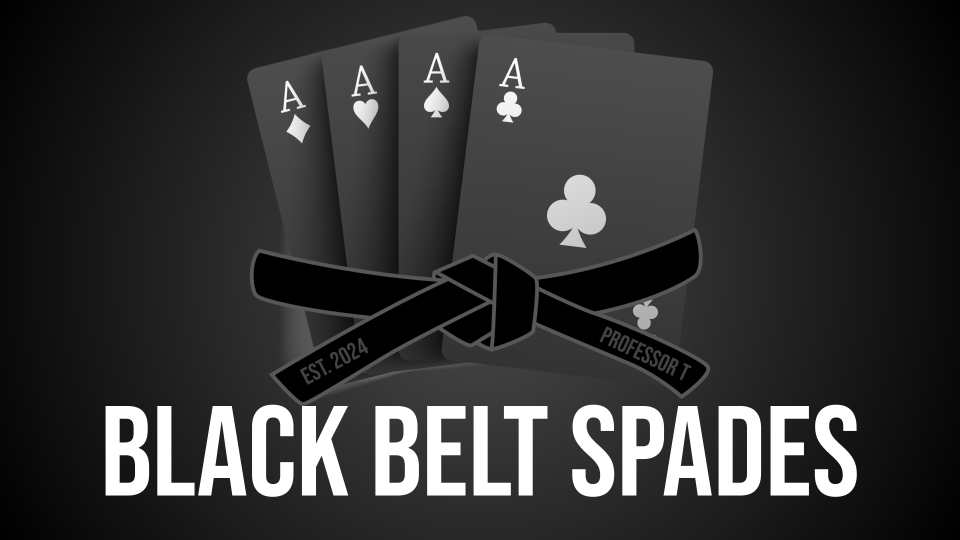

# Per Scholas CP 325: Capstone Project

* **Name**: Richard Tillies
* **Date**: April 24, 2024
* **Requirements**: 
[CP 325.9 Capstone Completion](client/public/docs/CP-325.9-Capstone-Completion.pdf)

## Objectives

* (20%) **Project Structure, Standardization, and Convention**
* (12%) **Core JavaScript**
* (9%) **Database**
* (19%) **Server**
* (35%) **Front-End Development**
* (5%) **Presentation**

## Render and GitHub
* Render: **_[Black Belt Spades](https://black-belt-spades.onrender.com/)_**
* GitHub: **_[Black Belt Spades](https://github.com/rtillies/black-belt-spades)_**

## Navbar Links

* The brand logo (the belt image along with the **_Black Belt Spades_** text) and *Home* all take you back to the home splash page.
* *Game Variations* is a largely static page with an accordion element from Bootstrap. Click an accordion header to display the details for that variation of spades gameplay (and hide the others).
* *Tournament* displays a dropdown menu with options to display *All Teams*, *All Games*, and *Dashboard*. These options are expanded upon in greater detail below.
* *Organizations* displays a dropdown menu with external links to the websites of different spades organizations.
* *GitHub* is an external link to the GitHub repository for this project.
* *Login* is currently a link to the same *Admin Dashboard* in the *Tournament* menu.
  * See notes below.

## Tournament

### Teams
Displays all teams in the tournament

  * *Add Team* button displays a form to add a new team to the database
    * *Return* button returns to the *All Teams* page
    * *Add Team* button adds the team to the database
      * All fields are required
    * *Reset* button returns all fields to default values

  * Click a *Team Name* to display the games played by that team
    * *All Teams* button returns to the *All Teams* page
    * *Update Team* button displays a form to update team information in the database 
    * *Delete Team* button displays a form to delete a team from the database 

### Games
  * Displays all games played in the tournament
  * *Add Game* button displays a form to add a new game to the database
    * *Return* button returns to the *All Games* page
    * *Add Game* button adds the team to the database
      * All fields are required
    * *Reset* button returns all fields to default values

## Additional Notes

### Future Iterations
* Add, Update, Delete _Conference_ and _Division_
* Display Teams by _Conference_ and _Division_
* Determine if a game is played between teams within the same _Conference_ and/or _Division_
* Display _Conference_ and _Division_ records 
* Admin login displays Admin Dashboard panel
  <!-- * Login mock-up available at `/login` -->
  * Dashboard mock-up available at `/admin`
* Add pagination to the _All Games_ page